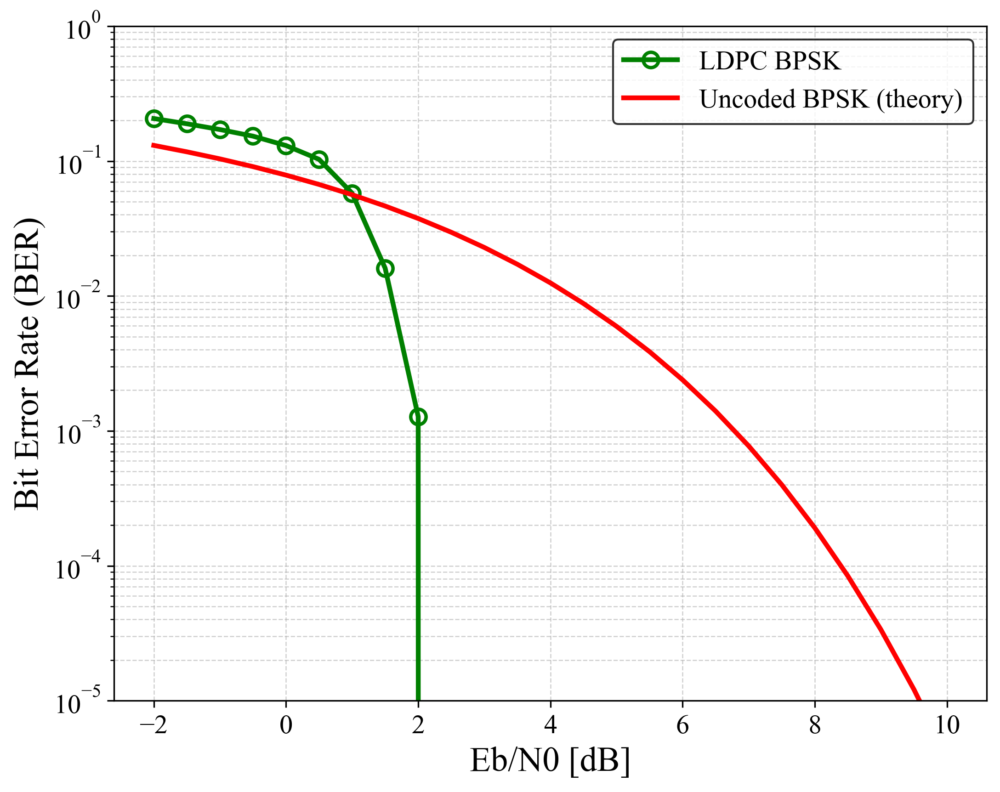

# fec-ldpc-codec


C implementation of **LDPC (Low-Density Parity Check) codes**
with **Sum-Product Algorithm (SPA) decoding**, **BPSK modulation**, and
**AWGN BER simulation**.

---

## 📘 Overview

This repository provides a lightweight and modular implementation of
**LDPC codes**, including:

- LDPC matrix loading from CSV (`H.csv` & `G.csv`)
- Systematic LDPC encoder
- Sum-Product Algorithm (SPA) LDPC decoder (LLR domain)
- BPSK modulation + AWGN channel
- BER simulation vs Eb/N0
- Interactive matrix folder selection
- Python plotting scripts (PNG/SVG support)

⚠ **Note:**
This implementation is **not based on standardized LDPC codes**
(e.g., *5G NR Base Graph 1/2*, *IEEE 802.11n/ac*, *DVB-S2*).
The LDPC matrices used here follow **Gallager-type (N, wc, wr)** random constructions,
intended for research and educational purposes.

---

## 📁 Project Structure

```
fec-ldpc-codec
├── src/                 # Encoder/decoder core implementation
├── include/             # Public header files
├── matrices/            # LDPC H,G matrix sets (CSV)
├── mains/               # BER simulation programs
├── results/             # Generated BER CSV files
├── images/              # BER plots (PNG/SVG)
├── python/              # Plotting scripts
├── .github/workflows/   # CI (GCC build)
├── Makefile             # Build rules
└── README.md            # This document
```

---

## 📑 Features

### ✔ LDPC Matrix Handling
- Loads **H.csv** and **G.csv** from:
  ```
  matrices/N{N}_wc{wc}_wr{wr}/
  ```
- Interactive folder selection at runtime
- CSV-based, easy to edit or generate externally

---

### ✔ LDPC Encoder (Systematic)
Encodes with:

```
code[i] = Σ_j inf[j] · G[j][i]  mod 2
```

Simple & fast GF(2) XOR accumulation.

---

### ✔ SPA LDPC Decoder
LLR-domain Sum-Product Algorithm:

- Check-node update (log-domain SPF)
- Variable-node update
- Parity-check validation
- Early stopping
- Research-friendly, fully readable reference implementation

---

### ✔ AWGN BER Simulation
- BPSK mapping (0 → -1, 1 → +1)
- Noise generation using **Box–Muller**
- LLR computation:
  ```
  LLR = 2y / σ²
  ```
- Eb/N0 sweep
- Output:
  ```
  results/ldpc_ber.csv
  ```

---

## 🛠 Build Instructions

### Requirements
- GCC or Clang
- `make`
- Linux / macOS / WSL / MinGW

---

### Build

```sh
make
```

Generated binary:

```
ldpc_ber   # BER simulation program
```

Clean build:

```sh
make clean
```

---

## 🚀 Usage Example

Run BER simulation:

```sh
./ldpc_ber
```

Interactive folder selection:

```
Available LDPC matrix folders:
  [0] matrices/N1024_wc3_wr6
  [1] matrices/N2048_wc4_wr8
Select folder index:
```

Output CSV:

```
results/ldpc_ber.csv
```

---

## 📉 BER Performance

Example BER curve for LDPC (SPA, BPSK, AWGN):



Generated by:

```sh
python python/plot_ldpc_ber.py
```

---

## 📂 Source Code Structure

### src/
| File | Description |
|------|-------------|
| `ldpc_encoder.c` | Systematic LDPC encoder |
| `ldpc_decoder.c` | SPA LDPC decoder |
| `ldpc_matrix.c`  | Matrix allocation & CSV loading |

### include/
| File | Description |
|------|-------------|
| `ldpc_encoder.h` | Encoder API |
| `ldpc_decoder.h` | Decoder API |
| `ldpc_matrix.h`  | Matrix loading API |

### mains/
| File | Description |
|------|-------------|
| `ldpc_ber.c` | BER simulation under AWGN |
| `gene_hg.c`  | Generate LDPC matrices (Gallager-type `(N, wc, wr)` construction) |

### python/
| File | Description |
|------|-------------|
| `plot_ldpc_ber.py` | BER plotting (PNG/SVG) |

---

## 🔒 Confidentiality Notice

All source code in this repository was developed independently
based solely on public standards (e.g., academic LDPC literature).
No confidential or proprietary information from any company,
internship, or NDA-protected source is used.

---

## 📜 License

This project is licensed under the **MIT License**.
You may use it for research, education, and commercial applications.

---

## 🤝 Contributing

Pull requests are welcome.
For major changes, please open an issue first.

---

## ⭐ Acknowledgements

Developed as part of research in
**Forward Error Correction (FEC)** and **physical-layer communications**.

If this repository is useful, please consider giving it a ⭐ on GitHub!
